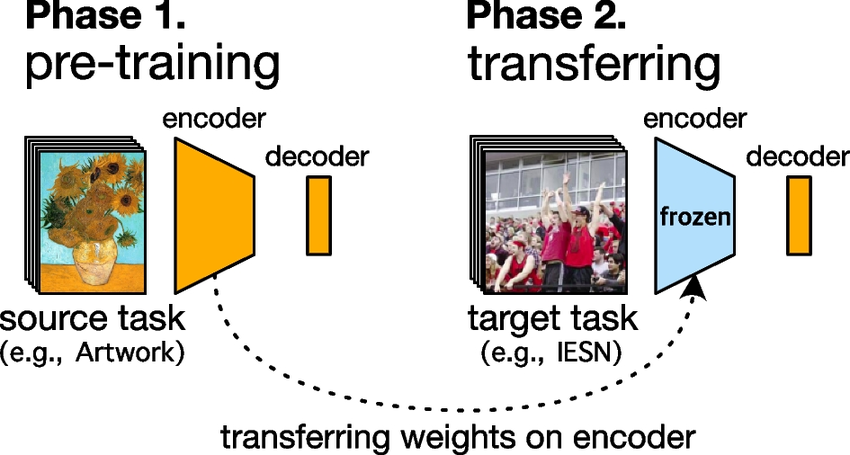
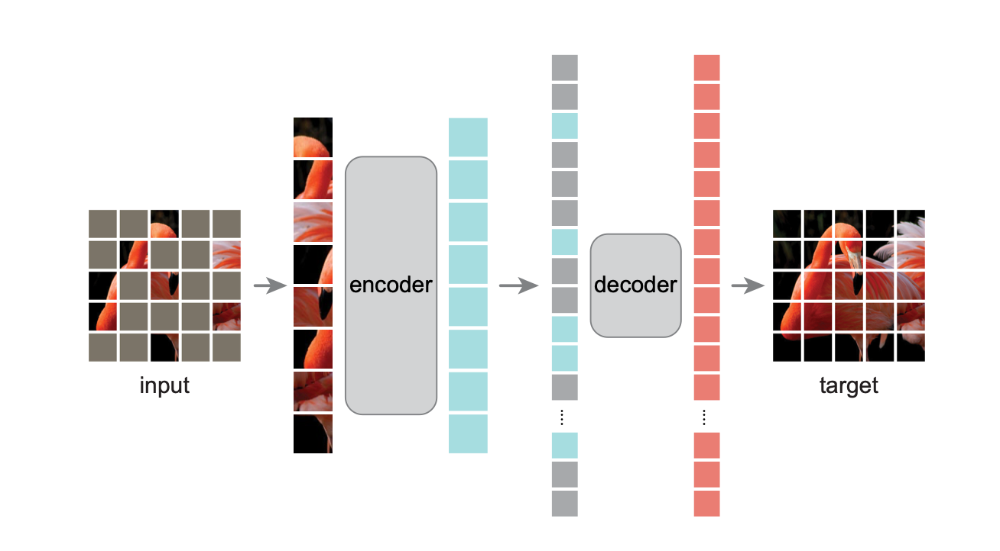
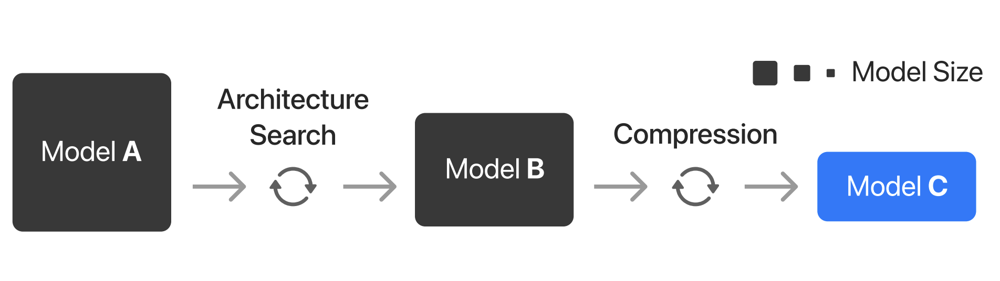

# Problem Definition

```{contents}
```

## Motivation

Currently, the most popular approach for deploying an object detection model in a production environment is to use YOLO {cite}`yolo` because it's fast and easy to use. However, to make it usable for your specific task you need to recollect a domain-specific dataset and fine-tune or train the model from scratch. This is a time-consuming and expensive process because such a dataset needs to be comprehensive enough to cover most of the possible scenarios that the model will encounter in the real world (weather conditions, different object scales and textures, etc). 

Recently, a new paradigm shift has emerged in the field as described by {cite}`bommasani2022`: instead of training a model from scratch for a specific task, you can use a model that was pre-trained on a generic task with massive data and compute as a backbone for your model and only fine-tune a decoder/head for your specific task (see {numref}`Figure {number} <knowledgetransfer>`). These pre-trained models are called Foundation Models and are great at capturing features that are useful for a wide range of tasks.

For example, we can train a vision model to predict missing patches in an image (see {numref}`Figure {number} <mim>`) and then fine-tune it for pedestrian detection.

:::::{grid} 2
:::{grid-item-card}  
:::{figure-md} knowledgetransfer


Transfer Learning is the process of reusing the knowledge acquired by a network trained in a source task for a network's target task. {cite}`hatakeyama2023`
:::
:::
:::{grid-item-card} 
:::{figure-md} mim


Masked Image Modelling is a self-supervised objective that consists in predicting missing patches from an image. {cite}`mae2021`
:::
:::
:::::

The drawback of using these foundation models is that they are large and computationally expensive, which makes them unsuitable for deployment in production environments, especially on edge devices. To address this issue, we need to optimize these models.


(part1:objectives)=
## Objectives

To ground our problem, we can use the framework described by {cite}`mcip` that Apple engineers use to deploy machine learning models on their devices. As we can see on {numref}`Figure {number} <apple_practice>`, this consists on three steps:

1. **Find a feasibility model A**: This involves training a model that can achieve the desired accuracy for the task.
2. **Find a smaller model B equivalent to A that is suitable for the device**: This may involve distilling the knowledge of model A into a smaller and/or more architecturally efficient model B that can be found through (neural) architecture search.
3. **Compress model B to reach production-ready model C**: This involves tuning the precision of the model to reduce its latency and memory cost to reach the performance budget.


:::{figure-md} apple_practice


Source: {cite}`mcip`
:::

In this work, we will focus on steps 1 and 3 which will be covered by Part 1 (Finding a Feasibility Model) and Part 2 (Optimization) respectively. 