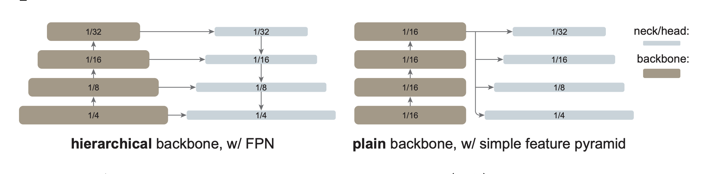

# Adapting ViTs

:::{note}
Hierarchical feature maps are a staple in the state of the art on Object Detection heads. This trend started because of convnets hierarchical nature. ViTs have a **fixed sized feature map**, and thus don't fit well in this framework.
:::

:::{important}
Given a feature map from a vit (B, H, W, D), generate a feature pyramid with upscaling and downscaling operations.
:::

:::{figure-md} sfp

Hierarchical Feature Pyramid vs Simple Feature Pyramid
:::

> [!done] Result
> This module allows ViTs to use SOTA detector heads like DETR, DINO, Mask-RCNN, etc.

