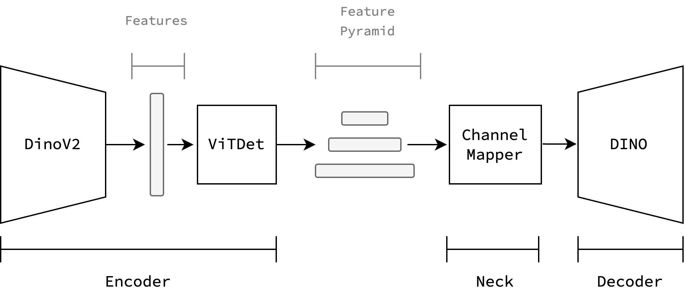

# Choosing a candidate model

Our task in this chapter is to choose a candidate architecture that allows us to use pre-trained vision foundation models as their backbone's feature extractor.


## State of the Art

A brief glimpse into the literature gives us some promising picks but also some fundamental questions. The first thing we find is that there is no clear winner between CNN-based and ViT-based models, especially when we factor latency/efficiency into the equation. Furthermore, neither CNN-based and ViT-based models have a clear best architectural variant (e.g vanilla ViT vs EVA's TrV's, ResNet vs ResNext) and sometimes the backbone's architecture itself is modified to better suit the task at hand (e.g Swin is a ViT with hierarchical features, useful for dense prediction tasks). Furthermore, some backbones are finetuned in task-specific datasets, which improves task-specific performance at expense of generality.

:::{tip}
More generally, the pretraining objective also matters. {cite}`park2023` shows that Contrastive learning favors image classification, while Masked Image Modelling favors dense prediction (object detection).
:::


{numref}`Table {number} <sota>` categorizes these model choices and summarizes its performance on the COCO dataset. However, as we described beforehand, these comparisons are often not fair, and a comprehensive evaluation would have to be done to determine the best backbone on all main tasks, and thus the best candidate as a vision foundation model. This question has been tackled by {cite}`botb` last year (2023), but its results are already outdated, as the most popular vit-based foundation models (dinov2 {cite}`dinov2`, eva02 {cite}`eva02`) were released afterwards. In any case, we want a model that is meant for general use, which narrows down the search.

 
```{table} State of the Art of Object Detection models
:name: sota


| Encoder                                          | Model                       | Decoder           | Size       | COCO  <br>(minival)              | FPS                      | Device | Code + <br>Weights |
| ------------------------------------------------ | --------------------------- | ----------------- | ---------- | -------------------------------- | ------------------------ | ------ | ------------------ |
| **CNN**                                          | YOLOv10                     | YOLOv10           | L          | 53.4                             | 137                      | T4[^1] | ✅                  |
|                                                  |                             |                   | X          | 54.4                             | 93                       | T4[^1] | ✅                  |
|                                                  | YOLOv8                      | YOLOv8            | L          | 52.9                             | 81                       | T4[^1] | ✅                  |
|                                                  |                             |                   | X          | 53.9                             | 59                       | T4[^1] | ✅                  |
|                                                  | RT-DETR {cite}`rtdetr`      | DETR              | R50        | 53.1                             | 108                      | T4[^1] | ✅                  |
|                                                  |                             |                   | R101       | 54.3                             | 73                       | T4[^1] | ✅                  |
|                                                  | ConvNext's {cite}`convnext` | Cascade Mask-RCNN | ConvNeXt-B | 54.0                             | 11.5                     | A100   | ✅                  |
|                                                  |                             |                   | ConvNext-L | 54.8                             | 10                       | A100   | ✅                  |
| **ViT** (w/<br> task-specific <br>modifications) | MViTv2 {cite}`mvitv2`       | Cascade Mask-RCNN | L          | 55.7                             | 5                        | A100   | ✅                  |
|                                                  |                             |                   | H          | 55.8                             | 3                        | A100   | ✅                  |
|                                                  | Co-DETR {cite}`codetr`      | Co-DETR           | ViT-L      | **65.9**[^2]                     | -                        | -      | ✅                  |
|                                                  |                             |                   | Swin-L     | 64.1                             | -                        | -      | ✅                  |
|                                                  | ConvNext {cite}`convnext`   | Cascade Mask-RCNN | Swin-B     | 53.0                             | 10.7                     | A100   | ✅<br>              |
|                                                  |                             |                   | Swin-L     | 53.9                             | 9.2                      | A100   | ✅<br>              |
| **ViT** (w/<br>modifications)                    | EVA-02 {cite}`eva02`        | Cascade Mask-RCNN | TrV-L      | 59.2<br>62.3[^2]<br>**64.1**[^2] | ~1.4x faster<br>than ViT | A100   | ✅<br>              |
| **ViT** (plain)                                  | ViTDet {cite}`vitdet`       | Cascade Mask-RCNN | ViT-B      | 54                               | 11                       | A100   | ✅<br>              |
|                                                  |                             |                   | ViT-L      | 57.6<br>59.6[^2]<br>-            | 7                        | A100   | ✅<br>              |
|                                                  |                             |                   | ViT-H      | 58.7<br>**60.4**[^2]<br>-        | 5                        | A100   | ✅<br>              |
|                                                  | SimPLR {cite}`simplr`       | SimPLR            | ViT-L      | 58.7                             | 9                        | A100   | ❌                  |
|                                                  |                             |                   | ViT-H      | 59.8                             | 7                        | A100   | ❌                  |


```

## Final decision

To finally arrive at a decision, it is useful to think back to the original motivation of using VFMs: To leverage the knowledge acquired by a model pre-trained with extensive data and compute. To keep ourselves future-proofed, we chose **Dinov2** {cite}`dinov2` as the backbone, as it has the most support from the community and the authors at Meta. With the same reasoning, we chose the **VitDet** {cite}`vitdet` adapter which allows us to use almost any decoder head. To stay at the state-of-the-art we chose the **DINO** {cite}`dinodetr` decoder. 

:::{figure-md} arch


Model architecture: Dinov2 backbone, VitDet adapter, DINO decoder.
::: 


[^1]: With TensorRT FP16.
[^2]: Extra task-specific fine-tuning from {cite}`eva02`.
