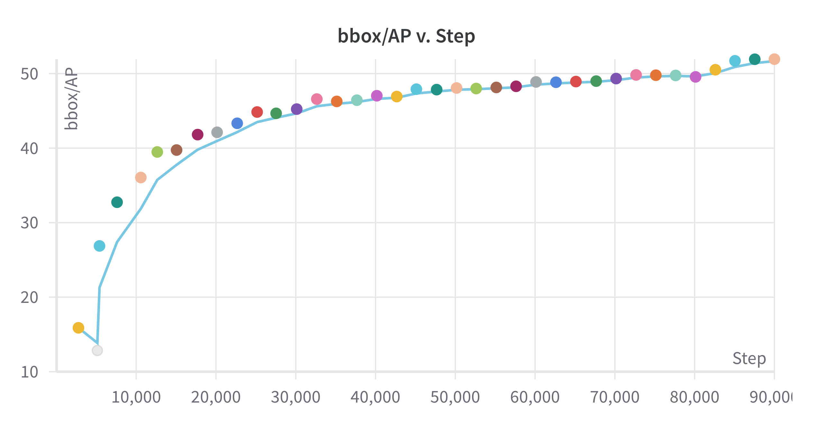
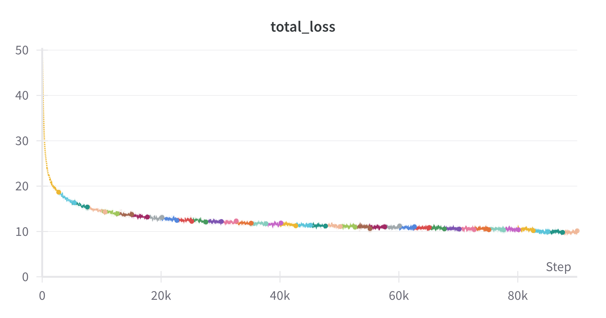
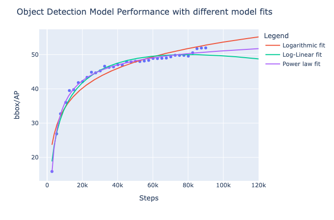
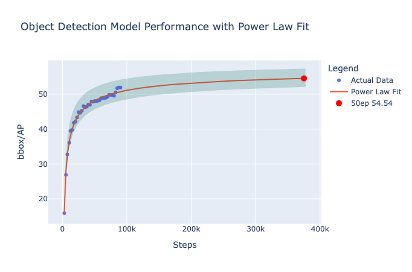

# Training the Decoder

Now we have a working model with a pre-trained backbone, but we still need to train the decoder. Training this model, however, requires quite a bit of compute and time, if we follow the original training recipe: With a NVIDIA A100 GPU (full-node, 80GB), a batch size of 16 uses almost 90% of the memory and takes around 30 hours to train 12 epochs, on full precision. Training scripts for a SLURM cluster are provided in the `scripts/slurm` folder, but we'll first test that everything works correctly.

## Testing the Training Script

To test the training script locally with a single 16GB GPU, we'll can do a couple of things: Reducing batch size, using a smaller model, and enabling mixed precision training:

```bash
WANDB_MODE=offline python -m scripts.train_net --num-gpus=1 \
--config-file=projects/dino_dinov2/configs/COCO/dino_dinov2_b_12ep.py \
dataloader.train.total_batch_size=2 \
dataloader.train.num_workers=2 \
train.amp.enabled=True \
model.backbone.net.model_name="vit_small_patch14_dinov2.lvd142m"
```

In {numref}`Table {number} <training_configs>` we can see how these choices affect both inference speed and memory usage. We should expect mixed precision training to considerably improve over full precision with larger batch sizes, as the former only reduces precision to the activations and not the weights. Furthermore, if the GPU at hand is new enough (Ampere architecture or newer), mixed precision training almost incurs on no accuracy penalty, as it uses the dtype `bfloat16`.

```{table} Ablation of training configurations
:name: training_configs

| Backbone | Precision | Batch Size | Time per Iteration | Memory Usage |
| --- | --- | --- | --- | --- |
| ViT-B | Full | 2 | 0.8822 s | 11656 MiB |
| ViT-B | Mixed | 2 | 0.6083 s | 9916 MiB |
| ViT-S | Full | 2 | 0.7500 s | 11363 MiB | 
| ViT-S | Mixed | 2 | 0.5973 s | 10031 MiB | 

```


## Training Results

In figures {numref}`boxap` and {numref}`loss` we can see the validation BoxAP and training loss over 12 epochs, respectively. 

TODO:
- [ ] Mention the little bump at the end from the learning rate scheduler (2eps)
- [ ] Mention that the model is not saturated

::::{grid} 2
:::{grid-item-card} 
:::{figure-md} boxap


Validation BoxAP over 12 epochs
:::
:::
:::{grid-item-card}  
:::{figure-md} loss


Training loss over 12 epochs
:::
:::
::::


## Predicting performance at 50 epochs

TODO
- [ ] Mention that model is trained for 12eps and 50eps, but the 50ep is the one that is used in evaluations
- [ ] Let's fit some curves and forecast performance at 50eps
- [ ] Mention the little accuracy increase at the last 10eps of the training
- [ ] Mention that the normal vit config can be used as reference: detrex/projects/dino/configs/dino-vitdet/dino_vitdet_base_4scale_50ep.py
- [ ] lr scheduler information can be found at :detrex/detrex/config/configs/common/coco_schedule.py

::::{grid} 2
:::{grid-item-card} 
:::{figure-md} scaling


Caption
:::
:::
:::{grid-item-card}  
:::{figure-md} scaling_prediction


Caption
:::
:::
::::